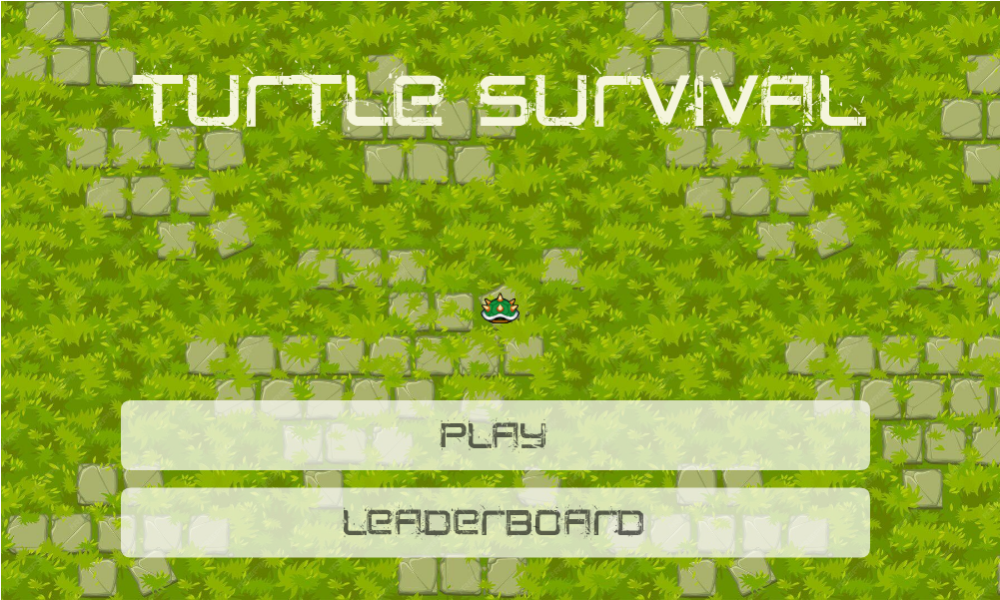

# Turtle Survival

Jeu de survie en JavaScript vanilla — canvas 2D pur, sans moteur ni aucune dépendance.

**▶️ [Jouer dans le navigateur](https://theodubus.github.io/turtle_survival/)** (ordinateur ou mobile)

[](https://theodubus.github.io/turtle_survival/)

## Le jeu

Vous êtes une tortue. Survivez le plus longtemps possible face à des vagues d'ennemis
dont la densité augmente au fil du temps.

- 🥬 **Nourriture** : mangez pour récupérer des points de vie
- ⭐ **Étoile** : invincibilité et boost de vitesse temporaires
- 👻 **Le fantôme** : le toucher vous fait basculer dans le monde des fantômes —
  les ennemis y sont bien plus nombreux, des projecteurs vous traquent, et vous
  repartez avec une seconde barre de vie
- 🏆 **Score** : combinaison du temps de survie et des ennemis éliminés, avec
  classement des parties de la session

## Contrôles

| Action | Ordinateur | Mobile |
|---|---|---|
| Se déplacer | flèches directionnelles ou `ZQSD` | joystick tactile |
| Pause / quitter | boutons à l'écran | boutons à l'écran |

## Sous le capot

Tout est fait à la main, sans framework : ~2 800 lignes réparties en 12 modules ES
(boucle de jeu à *delta time*, monde qui se déplace autour du joueur, sprites animés
par direction, apparitions aléatoires par échantillonnage gaussien, interface et
échelle adaptées automatiquement au mobile).

```bash
# lancer en local
python3 -m http.server
# puis ouvrir http://localhost:8000
```

<div align="right" style="display: flex">
    
    <a href="https://github.com/theodubus" alt="https://github.com/theodubus"></a>
    <a href="LICENSE" alt="licence"></a>
</div>
